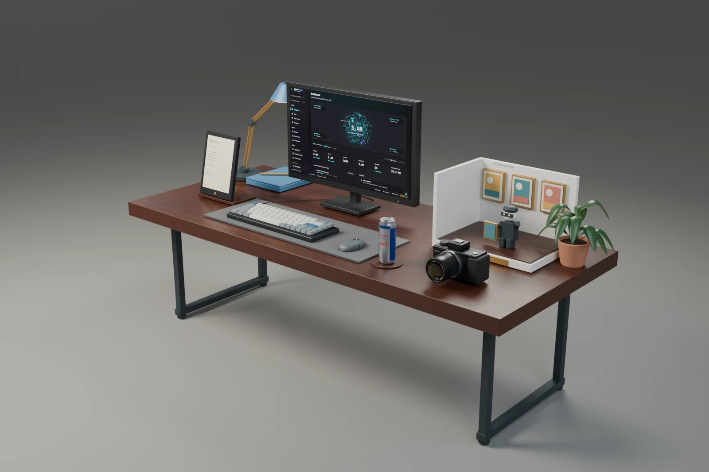
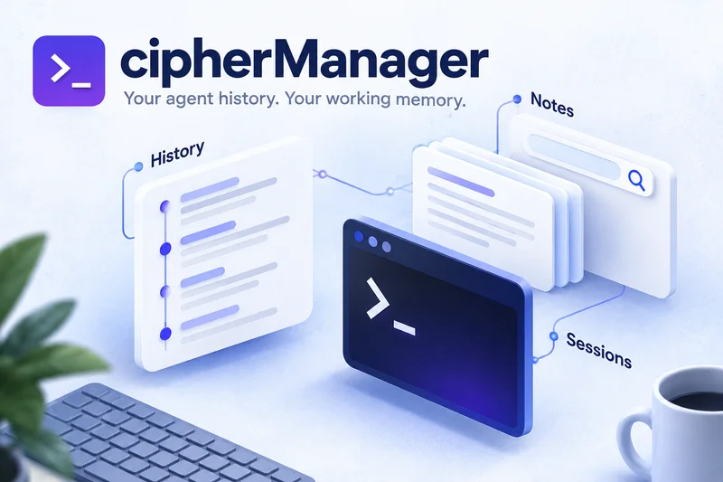
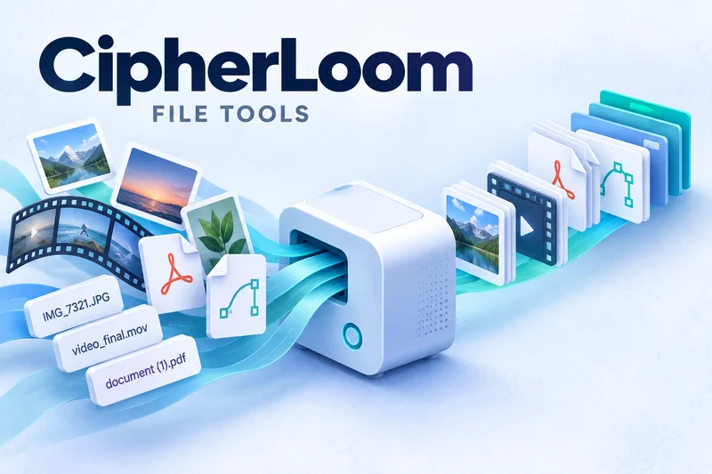
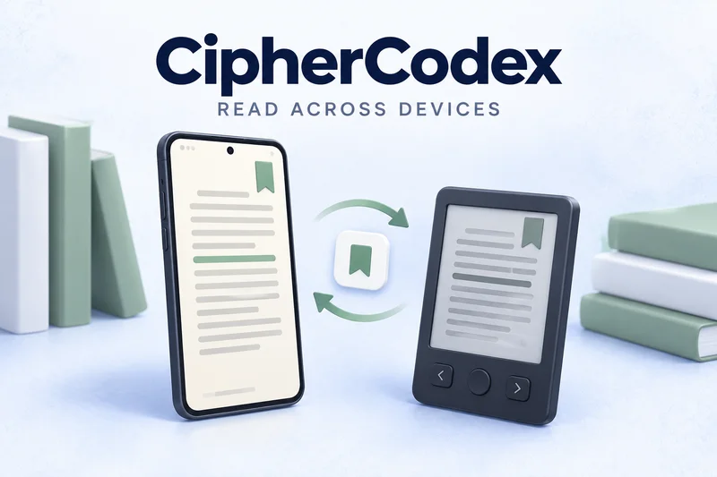
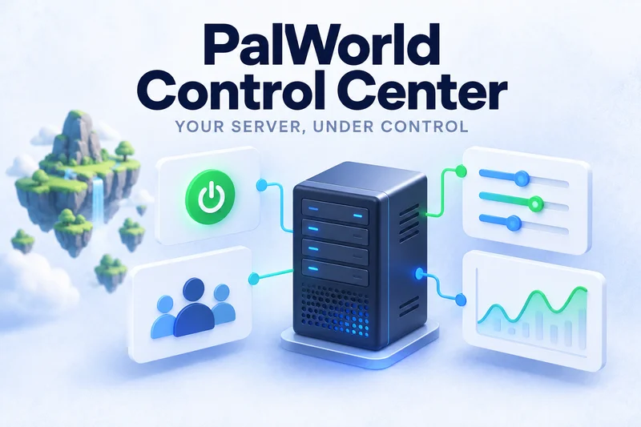
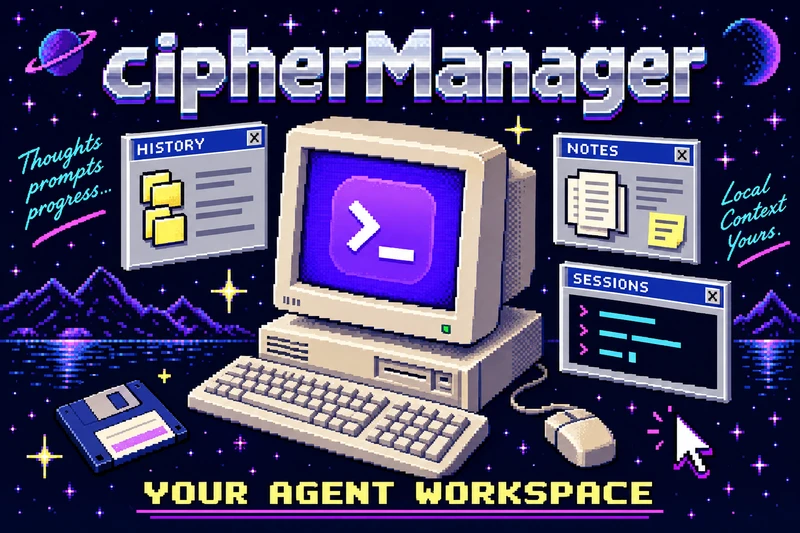
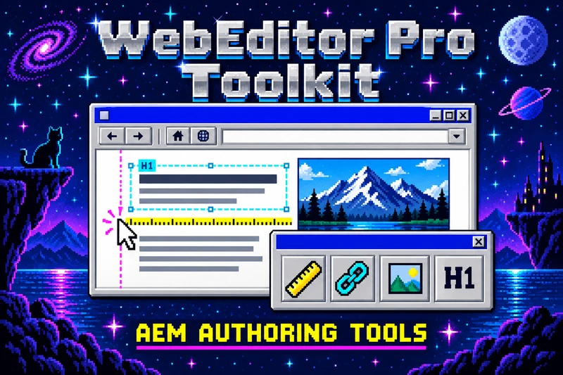
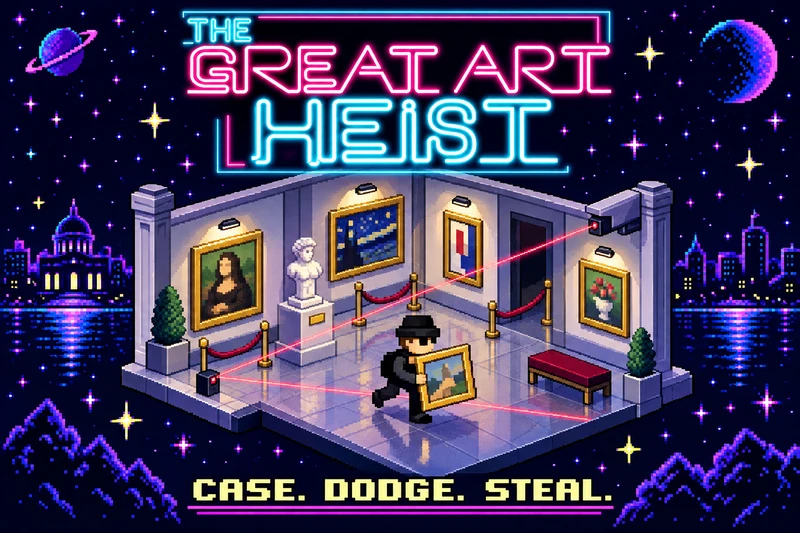

MATTHEW STEVENS / DEVELOPER &amp; DESIGNER

<h1 align="center">I build tools. And worlds.</h1>

Developer &amp; designer. Desktop apps, connected reading, games, and useful things for the web.

  <a href="https://matthewstevens.me">Portfolio &amp; 3D workshop</a> &nbsp;·&nbsp;
  <a href="https://matthewstevens.me/assets/Matthew-Stevens-Resume.pdf">Résumé</a> &nbsp;·&nbsp;
  <a href="https://linkedin.com/in/mrzeapple">LinkedIn</a> &nbsp;·&nbsp;
  <a href="mailto:matthew.stevens@matthewstevens.me">Email</a>

I'm Matthew, a developer and designer. I build responsive web experiences, publishing tools, and accessible interfaces. My projects span desktop apps, connected reading, games, 3D, and photography—usually starting with something I wanted to make easier or more interesting.

## Selected builds

Different platforms. Real problems to solve.

<table>
<tr>
<td width="50%" valign="top">

<h3><a href="https://github.com/mrzeappleGit/cipher-manager">cipherManager</a></h3>

A Windows workspace for local agent history, notes, and interactive sessions. Browse Claude, Codex, and Antigravity conversations and keep useful context close.

<code>TypeScript</code> <code>React</code> <code>Rust</code> <code>Tauri 2</code>

</td>
<td width="50%" valign="top">

<h3><a href="https://github.com/mrzeappleGit/convertToWebP">CipherLoom</a></h3>

A desktop toolkit for repetitive creative work: image conversion, target-size video compression, file renaming, PDF rendering, and SVG image mapping.

<code>TypeScript</code> <code>React</code> <code>Rust</code> <code>FFmpeg</code>

</td>
</tr>
<tr>
<td width="50%" valign="top">

<h3><a href="https://github.com/mrzeappleGit/ciphercodex">CipherCodex</a></h3>

EPUB reading from an Android phone to an Xteink X4 e-reader. The app and <a href="https://github.com/mrzeappleGit/ciphercodex-os">companion firmware</a> share reading progress through KOReader sync.

<code>Kotlin</code> <code>Jetpack Compose</code> <code>ESP32</code>

</td>
<td width="50%" valign="top">

<h3><a href="https://github.com/mrzeappleGit/WebEditor-Pro-Toolkit">WebEditor Pro Toolkit</a></h3>

A Chrome extension for AEM authors. Inspect spacing, label headings and links, check image sizes, and open configured published-page destinations.

<code>JavaScript</code> <code>Chrome Extensions</code> <code>Adobe AEM</code>

</td>
</tr>
<tr>
<td width="50%" valign="top">

<h3><a href="https://github.com/mrzeappleGit/PalWorld-Control-Center">PalWorld Control Center</a></h3>

A desktop control panel for a dedicated PalWorld server: manage processes and players, edit configuration, and monitor CPU and memory.

<code>Python</code> <code>Tkinter</code> <code>RCON</code> <code>psutil</code>

</td>
<td width="50%" valign="top">

<h3><a href="https://store.steampowered.com/app/1315780/The_Great_Art_Heist/">The Great Art Heist</a></h3>

A pixel-art heist game built in Unity and released on Steam. Case the gallery, dodge security, and steal the masterpieces.

<code>Unity</code> <code>C#</code> <code>Steam</code>

</td>
</tr>
</table>

## More from the workshop

- **[Web Image Audit](https://github.com/mrzeappleGit/WebImageAudit)** — compare website images between live and test environments.
- **[CipherFin](https://github.com/mrzeappleGit/cipherfin)** — natural-language playlist discovery for a personal Jellyfin library.
- **[CipherPeak Bing Bong TTS](https://github.com/mrzeappleGit/CipherPeak-BingBongTTS)** — Twitch chat turned into in-game speech in PEAK.
- **[Easier Games & Easier Tickets](https://github.com/mrzeappleGit/Portfolio)** — earlier storefront and event-ticketing concepts.

[Browse all repositories →](https://github.com/mrzeappleGit?tab=repositories)

## My development toolkit

| Building | Tools I use |
| :--- | :--- |
| Web & authoring | HTML, CSS, JavaScript, TypeScript, React, Node.js, Sass, AEM, Adobe Target, Lit |
| Desktop & automation | Rust, Tauri, Python, FFmpeg, Chrome Extensions API |
| Reading & devices | Kotlin, Jetpack Compose, ESP32, KOReader sync |
| Games & visual work | Unity, C#, Unreal Engine, Blender, Figma, Photoshop, Illustrator |
| Web operations | Accessible components, WCAG, Adobe Analytics, JCR-SQL2, ACS Commons |

## GitHub, by the numbers

<!-- STATS:START -->
| Public repositories | Original repositories | Unarchived originals | Stars on originals |
| :---: | :---: | :---: | :---: |
| 22 | 20 | 18 | 3 |

Languages across my original public repositories

| Primary language | Repositories |
| :--- | ---: |
| JavaScript | 4 |
| Python | 4 |
| Java | 3 |
| C# | 2 |
| Swift | 2 |
| TypeScript | 2 |
| C | 1 |
| HTML | 1 |
| Kotlin | 1 |

GitHub's primary language per repository, including archived originals. Forks and repositories without a detected language are excluded from this table. These are repository counts, not code percentages or proficiency scores.

Updated 2026-09-22 (UTC) from the public GitHub API. Refreshed daily by [GitHub Actions](https://github.com/mrzeappleGit/mrzeappleGit/actions/workflows/stats.yml). Private work is not included.
<!-- STATS:END -->

[Explore my contribution activity →](https://github.com/mrzeappleGit?tab=overview)

## Beyond the code

[Photography](https://matthewstevens.me/photography/) · [3D design](https://matthewstevens.me/3d/) · [Interactive workshop](https://matthewstevens.me)

B.S. in Digital Art and Design, with a minor in Website Design & Development, 2021.

<strong>★ Enter GeoCities mode</strong> — 56k spirit, fiber speed

### Welcome to my corner of the world wide web.

Handmade things. Excessive curiosity. Forever under construction.

<table>
<tr>
<td width="33%"></td>
<td width="33%"></td>
<td width="33%"></td>
</tr>
</table>

Visit [my homepage](https://matthewstevens.me) and choose **GeoCities** for the full starfield-and-desktop-window experience.

---

Projects, questions, or a good hello. <a href="mailto:matthew.stevens@matthewstevens.me">Let's compare notes.</a> <a href="https://instagram.com/mrzeapple">Instagram</a> · <a href="https://twitter.com/mrzeapple">Twitter / X</a> Matthew Thomas Stevens Studios LLC

